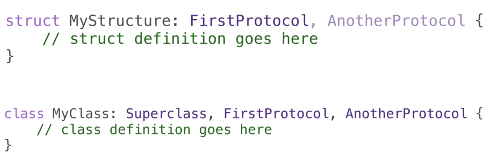
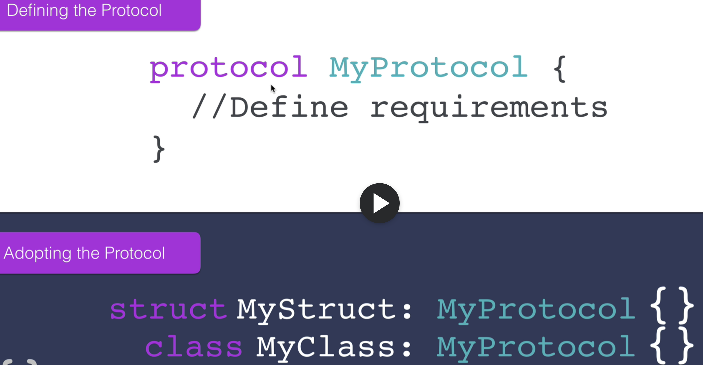

# protocols-demo-section-13-145

- Protocols
- Protocols can be adopted by structures or classes
- CanFly protocol as a data type
- You can also adopt multiple protocols

- Any struct or class can take more than one protocol

- Defining and adopting the protocol

